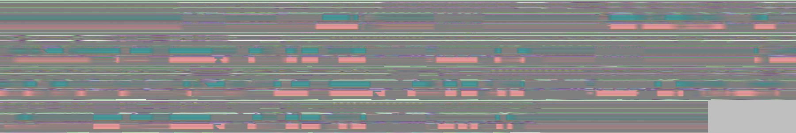

## vmd2png 概要（日本語）

vmd2png は、MikuMikuDance（MMD）の VMD モーションファイルを処理するための Python 製ユーティリティライブラリです。VMD モーションデータを PNG 画像や NPY 配列形式でエクスポートする機能を提供し、内蔵のビューワーでモーションを 3D プレビューすることもできます。

## 画像形式でのモーション？



上の画像は、約 4 分間の VMD モーションを変換した例です。  
ここでは、モーションの視覚的な特徴を保ちながら、できるだけ効率よく保存できるようなエンコード方式を採用しています。  
その結果、モーションのパターンを一目で把握できるだけでなく、スムーズな遷移か、ギザギザしたピクセル状の部分が多いかを見ることで、モーションの品質をざっくり評価することもできます。

モーションデータを画像として表現するという発想は、一見すると少し奇妙に思えるかもしれませんが、次のような利点があります。

1. **可視化**: PNG 画像として簡単に表示できるため、専用ソフトを使わずにモーションデータを素早く確認できます。
2. **保存形式**: PNG は広くサポートされているフォーマットであり、16bit チャンネルを使って十分な精度を保ちながら、比較的コンパクトにデータを保存できます。上の例では、VMD 形式で約 17MB のモーションが、PNG 形式では約 1.2MB まで小さくなっています。
3. **データ解析**: モーションを、NumPy などの機械学習フレームワークに直接読み込める形式で保存できるため、モーション予測やモーション生成など、AI モデルの学習に活用しやすくなります。

## 機能

- **VMD のパース**: VMD ファイルを読み込み、ボーンおよびカメラのモーションデータを抽出します。
- **PNG 形式**: モーションデータを 16bit PNG 画像として表現し、可視化と保存の両方に利用できます。
- **NPY 形式**: モーションデータを NumPy の `.npy` 形式で保存し、Python からの操作や機械学習用途に使いやすくします。
- **変換**: VMD / PNG / NPY の各形式のあいだで相互に変換できます。
- **マージ**: 役者（Actor）用 VMD とカメラ用 VMD を 1 つの VMD に結合できます。
- **プレビュー**: 追加のソフトウェアなしで、役者およびカメラのモーションをプレビューできます。

## インストール

```bash
git clone https://github.com/alloystorm/vmd2png.git
cd vmd2png
pip install .
```

## CLI の使い方

このパッケージは `vmd2png` というコマンドラインツールを提供します。

### プレビュー

VMD / PNG / NPY ファイルを 3D でプレビューします。

```bash
vmd2png preview path/to/motion.vmd
# 足 IK を有効にする
vmd2png preview path/to/motion.vmd --ik
# 別ファイルのカメラモーションを使用する
vmd2png preview path/to/actor.vmd --camera path/to/camera.vmd
# 変換済み PNG / NPY をプレビューする
vmd2png preview path/to/motion.png
vmd2png preview path/to/motion.npy
```

### 変換

VMD を PNG / NPY 形式に変換します。

```bash
vmd2png convert path/to/file.vmd -t png
vmd2png convert path/to/file.vmd -t npy
```

役者とカメラのモーションを、別々の VMD から 1 つの VMD に統合します。

```bash
vmd2png convert actor.vmd --camera camera.vmd -o combined.vmd -t vmd
```

PNG / NPY を VMD に戻します。

```bash
vmd2png convert path/to/file.png -t vmd
vmd2png convert path/to/file.npy -t vmd
```

## 注意点

- 本ツールは標準的な MMD のボーン構造を前提としています。詳細は [skeleton.py](src/vmd2png/skeleton.py) を参照してください。カスタムボーンに対するモーションは、変換後には失われます。
- 表情・モーフは、現時点では PNG / NPY 形式に対応していないため、変換時にすべて失われます。
- モーションデータの精度を確保するために 16bit PNG を使用しています。画像を編集したり、メールやメッセンジャーで送信する際に 8bit に再圧縮されると、モーションデータが破損するので注意してください。
- PNG / NPY 形式では、すべてのフレームを 1 フレームずつ展開して保存します。そのため、PNG / NPY から VMD に再変換すると元のキー情報は失われ、生成される VMD ファイルは元のファイルよりも大きくなる場合があります。

## 今後の予定

- モーションキャプチャデータ用の BVH 対応。
- 標準的な表情モーフへの対応。

## ライセンス

このプロジェクトは MIT ライセンスのもとで公開されています。詳細は [LICENSE](LICENSE) ファイルを参照してください。